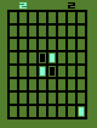

### Othello

This environment is part of the [Atari environments](../atari). Please read that page first for general information.



`from pettingzoo.atari import othello_v0`

`agents= ["first_0", "second_0"]`

*AEC diagram*

The classic board game of long term strategy.

The goal is to flip over your opponents pieces. You can flip over your opponent's pieces (changing them to your color) by placing a piece in a row or diagonal which traps your opponents pieces between your own. You must capture at least one piece each turn ([othello rules](https://www.mastersofgames.com/rules/reversi-othello-rules.htm)).

Note that it is known that the greedy heuristic of maximizing the number of pieces you have at any given time is a very poor heuristic, making learning more interesting.

To place a piece, one must move the cursor to a valid location on the map and hit fire. The controls are fairly sticky, meaning actions need to be repeated for awhile before they register.

The score is the number of pieces you have on the board. The reward given is the difference is relative reward, so if you flip over 5 pieces of your opponent one turn, you get +6 reward and your opponent gets -6 reward, because you have 6 new pieces (the one you placed plus the 5 you flipped over).

Note that following this reward greedily is known to be a bad long-term strategy, so in order to successfully solve this game, you must think long term.

When one player cannot move, the tokens on both sides are tallied, and the player with the most tokens wins! (receives +1 reward, and their opponent -1).

Note that since this is an untimed turn based game, a player can choose to do nothing, which is a good strategy to never lose. 

[Official othello manual](https://atariage.com/manual_html_page.php?SoftwareLabelID=335)

#### Environment parameters

Environment parameters are common to all Atari environments and are described in the [base Atari documentation](../atari) .
