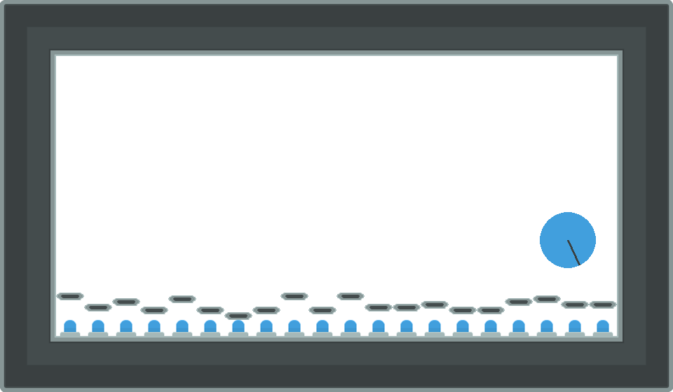

### Pistonball

This environment is part of the [butterfly environments](../butterfly.md). Please read that page first for general information.

| Actions | Agents | Manual Control | Action Shape | Action Values | Observation Shape | Observation Values | Num States |
|---------|--------|----------------|--------------|---------------|-------------------|--------------------|------------|
| Either  | 20     | Yes            | (1,)         | [0, 2]        | (200, 120, 3)     | (0, 255)           | ?          |

`from pettingzoo.butterfly import pistonball_v0`

`agents= ["piston_0", "piston_1", ..., "piston_19"]`



*AEC diagram*

This is a simple physics based cooperative game where the goal is to move the ball to the left wall of the game border by activating any of the twenty vertically moving pistons. Pistons can only see themselves, and the two pistons next to them.
Thus, pistons must learn highly coordinated emergent behavior to achieve an optimal policy for the environment. Each agent get's a reward that is a combination of how much the ball moved left overall, and how much the ball moved left if it was close to the piston (i.e. movement it contributed to). Balancing the ratio between these appears to be critical to learning this environment, and as such is an environment parameter. The local reward applied is 0.5 times the change in the ball's x-position. Additionally, the global reward is change in x-position divided by the starting position, times 100. For each piston, the reward is .02 * local_reward + 0.08 * global_reward. The local reward is applied to pistons surrounding the ball while the global reward is provided to all pistons.

Pistonball uses the chipmunk physics engine, and are thus the physics are about as realistic as Angry Birds.

Keys *a* and *d* control which piston is selected to move (initially the rightmost piston is selected) and keys *w* and *s* move the piston in the vertical direction.

```
pistonball.env(local_ratio=.02, continuous=False, random_drop=True,
starting_angular_momentum=True, ball_mass = .75, ball_friction=.3,
ball_elasticity=1.5, max_frames=900)
```

*about arguments*

```
local_ratio: Weight applied to local reward and global reward. Global reward weight will always be 1 - local reward weight.

continuous: If true, piston action is a real value between -1 and 1 which is added to the piston height. If False, then action is a discrete value to move a unit up or down.

random_drop: If True, ball will initially spawn in a random x value. If False, ball will always spawn at x=800

starting_angular_moment: If True, ball will spawn with a random angular momentum

ball_mass: Sets the mass of the ball physics object

ball_friction: Sets the friction of the ball physics object

ball_elasticity: Sets the elasticity of the ball physics object
```

Discrete Leaderboard:

| Average Total Reward | Method | Institution | Paper | Code |
|----------------------|--------|-------------|-------|------|
| x                    | x      | x           | x     | x    |

Continuous Leaderboard:

| Average Total Reward | Method | Institution | Paper | Code |
|----------------------|--------|-------------|-------|------|
| x                    | x      | x           | x     | x    |
