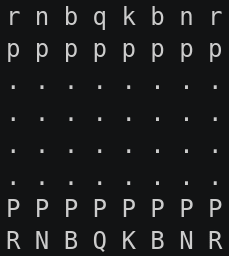

## Chess

This game part of the [classic games](../classic), please visit that page first for general information about these games.



Chess is one of the oldest studied games in AI. Our implementation of the observation and action spaces for chess are what the AlphaZero method uses, with two small changes.

#### Observation Space

Like AlphaZero, the observation space is an 8x8 image representing the board. It has 20 channels representing:

* First 4 channels: Castling rights:
* Next channel: Is black or white
* Next channel: A move clock counting up to the 50 move rule. Represented by a single channel where the *n* th element in the flattened channel is set if there has been *n* moves
* Next channel: all ones to help neural network find board edges in padded convolutions
* Next 12 channels: Each piece type and player combination. So there is a specific channel that represents your knights. If your knight is in that location, that spot is a 1, otherwise, 0. En-passant possibilities are represented by the pawn being on first row instead of the 4th (from the player who moved the pawn's perspective)
* Finally, a channel representing whether position has been seen before (is a 2-fold repetition)

Like AlphaZero, the board is always oriented towards the current agent (your king starts on the first row). So the two players are looking at mirror images of the board, not the same board.

Unlike AlphaZero, the observation space does not stack the observations previous moves by default. This can be accomplished using the `frame_stacking` argument of our wrapper.

#### Action Space

From the AlphaZero chess paper:

>> [In AlphaChessZero, the] action space is a 8x8x73 dimensional array.
Each of the 8×8
positions identifies the square from which to “pick up” a piece. The first 56 planes encode
possible ‘queen moves’ for any piece: a number of squares [1..7] in which the piece will be
moved, along one of eight relative compass directions {N, NE, E, SE, S, SW, W, NW}. The
next 8 planes encode possible knight moves for that piece. The final 9 planes encode possible
underpromotions for pawn moves or captures in two possible diagonals, to knight, bishop or
rook respectively. Other pawn moves or captures from the seventh rank are promoted to a
queen.

We instead flatten this into 8×8×73 = 4672 discrete action space.

#### Rewards

| Winner | Loser |
| :----: | :---: |
| +1     | -1    |

#### Legal Moves

The legal moves available for each agent, found in `env.infos[agent]['legal_moves']`, are updated after each step. Taking an illegal move ends the game with a reward of -1 for the illegally moving agent and a reward of 0 for all other agents.
