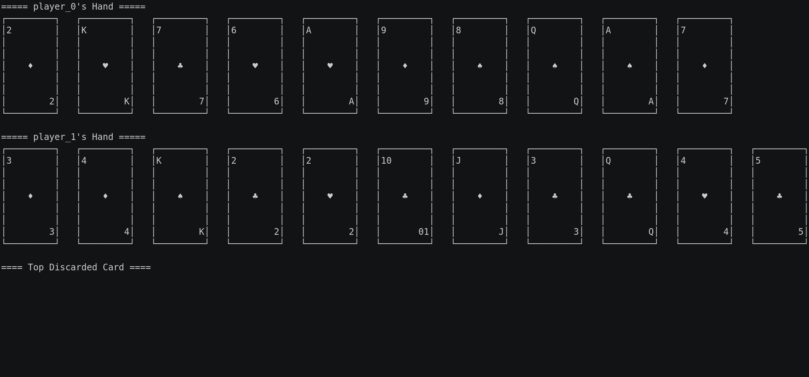

### Gin Rummy

This game part of the [classic games](../classic), please visit that page first for general information about these games.

| Actions  | Agents | Manual Control | Action Shape  | Action Values  | Observation Shape | Observation Values | Num States |
|----------|--------|----------------|---------------|----------------|-------------------|--------------------|------------|
| Discrete | 2      | No             | Discrete(110) | Discrete(110)  | (5, 52)           | [0,1]              | 10^52      |

`from pettingzoo.classic import gin_rummy_v0`

`agents= ['player_0', 'player_1']`



*AEC Diagram*

Gin Rummy is a 2 players card game with a 52 card deck. The objective is to combine 3 or more cards of the same rank or cards in sequence of the same suit.

Our implementation wraps [RLCard](http://rlcard.org/games.html#gin-rummy) and you can refer to its documentation for additional details. Please cite their work if you use this game in research.

### Environment arguments

Gin Rummy takes two optional arguments that define the reward received by a player who knocks or goes gin. The default values for the knock reward and gin reward are 0.5 and 1.0, respectively.

```
gin_rummy.env(seed=None, knock_reward = 0.5, gin_reward = 1.0)
```

```
seed: seed for random values. Set to None to use machine random source. Set to fixed value for deterministic behavior

knock_reward: reward received by a player who knocks

gin_reward: reward received by a player who goes gin
```

#### Observation Space

The observation space is (5, 52) with the rows representing different planes and columns representing the 52 cards in a deck. The cards are ordered from Ace of spades to King of spades, Ace of hearts to King of hearts, Ace of diamonds to King of diamonds, followed by the Ace of clubs to King of clubs.

| Row Index | Description                                    |
|:---------:|------------------------------------------------|
|     0     | Current player's hand                          |
|     1     | Top card of the discard pile                   |
|     2     | Cards in discard pile (excluding the top card) |
|     3     | Opponent's known cards                         |
|     4     | Unknown cards                                  |

| Column Index | Description                                       |
|:------------:|---------------------------------------------------|
|    0 - 12    | Spades<br>_`0`: Ace, `1`: 2, ..., `12`: King_     |
|    13 - 25   | Hearts<br>_`13`: Ace, `14`: 2, ..., `25`: King_   |
|    26 - 38   | Diamonds<br>_`26`: Ace, `27`: 2, ..., `38`: King_ |
|    39 - 51   | Clubs<br>_`39`: Ace, `40`: 2, ..., `51`: King_    |

#### Action Space

There are 110 actions in Gin Rummy.

| Action ID | Action                                                                                                                                                                                 |
|:---------:|----------------------------------------------------------------------------------------------------------------------------------------------------------------------------------------|
|     0     | Score Player 0<br>_Used after knock, gin, or dead hand to compute the player's hand._                                                                                                  |
|     1     | Score Player 1<br>_Used after knock, gin, or dead hand to compute the player's hand._                                                                                                  |
|     2     | Draw a card                                                                                                                                                                            |
|     3     | Pick top card from Discard pile                                                                                                                                                        |
|     4     | Declare dead hand                                                                                                                                                                      |
|     5     | Gin                                                                                                                                                                                    |
|   6 - 57  | Discard a card<br>_`6`: A-Spades, `7`: 2-Spades, ..., `18`: K-Spades<br>`19`: A-Hearts ... `31`: K-Hearts<br>`32`: A-Diamonds ... `44`: K-Diamonds<br>`45`: A-Clubs ... `57`: K-Clubs_ |
|  58 - 109 | Knock<br>_`58`: A-Spades, `59`: 2-Spades, ..., `70`: K-Spades<br>`71`: A-Hearts ... `83`: K-Hearts<br>`84`: A-Diamonds ... `96`: K-Diamonds<br>`97`: A-Clubs ... `109`: K-Clubs_       |

For example, you would use action `2` to draw a card or action `3` to pick up a discarded card.

#### Rewards

At the end of the game, a player who gins is awarded 1 point, a player who knocks is awarded 0.5 points, and the losing player receives a reward equal to the negative of their deadwood count.

If the hand is declared dead, both players get a reward equal to negative of their deadwood count.

| End Action                                | Winner | Loser               |
|-------------------------------------------|:------:|---------------------|
| Dead Hand<br>_Both players are penalized_ |   --   | -deadwood_count/100 |
| Knock<br>_Knocking player: Default +0.5_  |   --   | -deadwood_count/100 |
| Gin<br>_Going Gin Player: Default +1_     |   --   | -deadwood_count/100 |

Note that the defaults are slightly different from those in RLcard- their default reward for knocking is 0.2.

Penalties of deadwood_count/100 ensure that the reward never goes below -1.

#### Legal Moves

The legal moves available for each agent, found in `env.infos[agent]['legal_moves']`, are updated after each step. Taking an illegal move ends the game with a reward of -1 for the illegally moving agent and a reward of 0 for all other agents.
