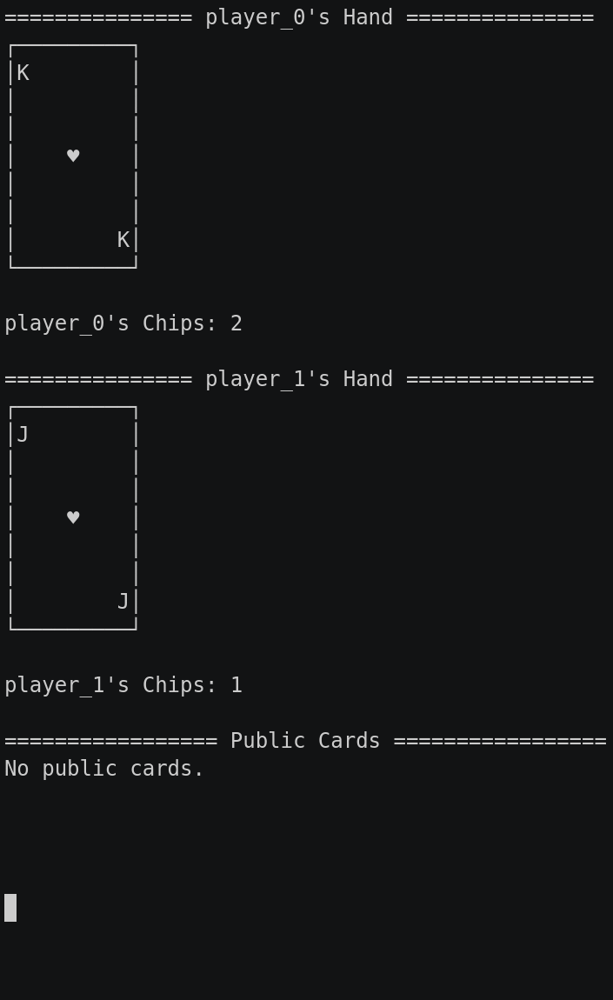

### Leduc Hold'em


This game part of the [classic games](../classic), please visit that page first for general information about these games.


`from pettingzoo.classic import leduc_holdem_v0`


`agents= ['player_0', 'player_1']`





*AEC Diagram*


Leduc Hold'em is a variation of Limit Texas Hold'em with 2 players, 2 rounds and six cards in total (Jack, Queen, and King). At the beginning of the game, each player receives one card and, after betting, one public card is revealed. Another round follow. At the end, the player with the best hand wins and receives a reward (+1) and the loser receives -1. At any time, any player can fold.   


Our implementation wraps [RLCard](http://rlcard.org/games.html#leduc-hold-em) and you can refer to its documentation for additional details. Please cite their work if you use this game in research.


### Environment arguments


```

leduc_holdem.env(seed=None)

```


```

seed: seed for random values. Set to None to use machine random source. Set to fixed value for deterministic behavior

```


#### Observation Space


As described by [RLCard](https://github.com/datamllab/rlcard/blob/master/docs/games#leduc-holdem), the first 3 entries correspond to the player's hand (J, Q, and K) and the next 3 represent the public cards. Indexes 6 to 19 and 20 to 33 encode the number of chips by the current player and the opponent, respectively.


|  Index  | Description                                                                  |

|:-------:|------------------------------------------------------------------------------|

|  0 - 2  | Current Player's Hand<br>_`0`: J, `1`: Q, `2`: K_                            |

|  3 - 5  | Community Cards<br>_`3`: J, `4`: Q, `5`: K_                                  |

|  6 - 20 | Current Player's Chips<br>_`6`: 0 chips, `7`: 1 chip, ..., `20`: 14 chips_   |

| 21 - 35 | Opponent's Chips<br>_`21`: 0 chips, `22`: 1 chip, ..., `35`: 14 chips_       |


#### Action Space


| Action ID | Action |

|:---------:|--------|

|     0     | Call   |

|     1     | Raise  |

|     2     | Fold   |

|     3     | Check  |


#### Rewards


| Winner          | Loser           |

| :-------------: | :-------------: |

| +raised chips/2 | -raised chips/2 |


#### Legal Moves


The legal moves available for each agent, found in `env.infos[agent]['legal_moves']`, are updated after each step. Taking an illegal move ends the game with a reward of -1 for the illegally moving agent and a reward of 0 for all other agents.
