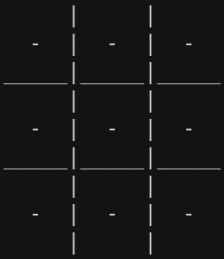

### Tic Tac Toe

This game part of the [classic games](../classic), please visit that page first for general information about these games.




`from pettingzoo.classic import tictactoe_v0`

`agents= ['player_1', 'player_2']`



*AEC Diagram*

Tic-tac-toe is a simple turn based strategy game where 2 players, X and O, take turns marking spaces on a 3 x 3 grid. The first player to place 3 of their marks in a horizontal, vertical, or diagonal row is the winner.

#### Observation Space

The observation is 2 layers of the 3x3 board. The first layer represents the placement of Xs, and the other layer is the placement of Os. The possible values for each cell is 0 or 1; in the first layer, 1 indicates that an X has been placed in that cell, and 0 indicates that X is not in that cell. Similarly, in the other layer 1 indicates that an O has been placed, while 0 indicates that 0 has not been placed.

#### Action Space

Each action from 0 to 8 represents placing either an X or O in the corresponding cell. The cells are indexed as follows:


 ```
0 | 3 | 6
_________

1 | 4 | 7
_________

2 | 5 | 8
 ```

#### Rewards

| Winner | Loser |
| :----: | :---: |
| +1     | -1    |

If the game ends in a draw, both players will receive a reward of 0.

#### Legal Moves

The legal moves available for each agent, found in `env.infos[agent]['legal_moves']`, are updated after each step. Taking an illegal move ends the game with a reward of -1 for the illegally moving agent and a reward of 0 for all other agents.
