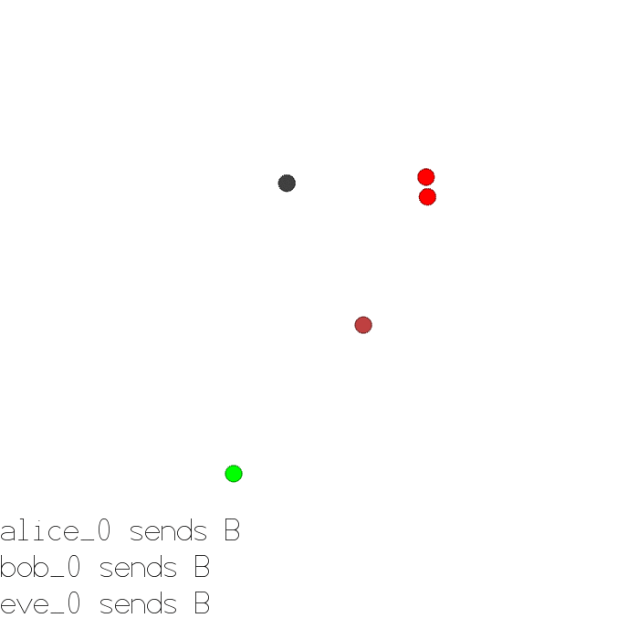

### Simple Crypto

This environment is part of the [MPE environments](../mpe). Please read that page first for general information. 




`pettingzoo.mpe import simple_crypto_v0`

`agents= [eve_0, bob_0, alice_0]`



*AEC diagram*

In this environment, there are 2 good agents (Alice and Bob) and 1 adversary (Eve). Alice must sent a private 1 bit message to Bob over a public channel. Alice and Bob are rewarded +2 if Bob reconstructs the message, but are rewarded -2 if Eve reconstruct the message (that adds to 0 if both teams reconstruct the bit). Eve is rewarded -2 based if it cannot reconstruct the signal, zero if it can. Alice and Bob have a private key (randomly generated at beginning of each episode), which they must learn to use to encrypt the message.


Alice observation space: `[message, private_key]`

Bob observation space: `[private_key, alices_comm]`

Eve observation space: `[alices_comm]`

Alice action space: `[say_0, say_1, say_2, say_3]`

Bob action space: `[say_0, say_1, say_2, say_3]`

Eve action space: `[say_0, say_1, say_2, say_3]`

For Bob and Eve, their communication is checked to be the 1 bit of information that Alice is trying to convey.

```
simple_crypto.env(seed=None, max_frames=100)
```

```
seed: seed for random values. Set to None to use machine random source. Set to fixed value for deterministic behavior

max_frames: number of frames (a step for each agent) until game terminates
```
