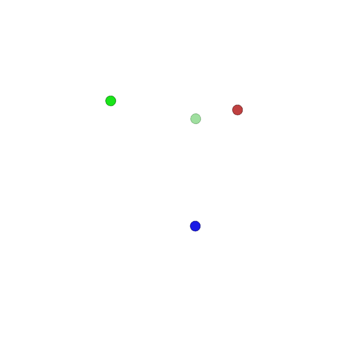

### Simple Push

This environment is part of the [MPE environments](../mpe). Please read that page first for general information.




`pettingzoo.mpe import simple_push_v0`

`agents= [adversary_0, agent_0]`



*AEC diagram*

This environment has 1 good agent, 1 adversary, and 1 landmark. The good agent is rewarded based on the distance to the landmark. The adversary is rewarded if it is close to the landmark, and if the agent is far from the landmark (the difference of the distances). Thus the adversary must learn to push the good agent away from the landmark.

Agent observation space: `[self_vel, goal_rel_position, goal_landmark_id, all_landmark_rel_positions, landmark_ids, other_agent_rel_positions]`

Adversary observation space: `[self_vel, all_landmark_rel_positions, other_agent_rel_positions]`

Agent action space: `[no_action, move_left, move_right, move_down, move_up]`

Adversary action space: `[no_action, move_left, move_right, move_down, move_up]`

```
simple_push.env(seed=None, max_frames=100)
```

```
seed: seed for random values. Set to None to use machine random source. Set to fixed value for deterministic behavior

max_frames: number of frames (a step for each agent) until game terminates
```
