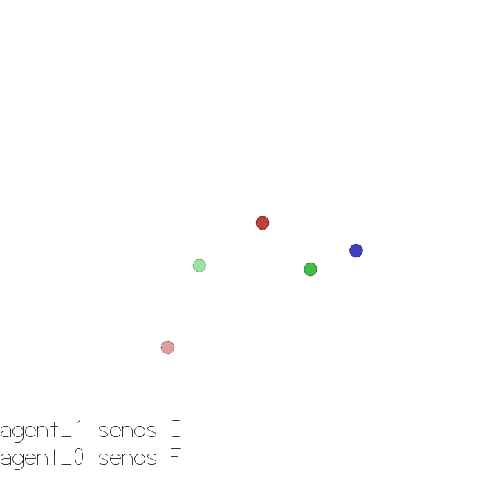

### Simple Reference

This environment is part of the [MPE environments](../mpe). Please read that page first for general information.




`pettingzoo.mpe import simple_reference_v0`

`agents= [agent_0, agent_1]`



*AEC diagram*

This environment has 2 agents and 3 landmarks of different colors. Each agent wants to get closer to their target landmark, which is known only by the other agents. Both agents are simultaneous speakers and listeners.

Locally, the agents are rewarded by their distance to their target landmark. Globally, all agents are rewarded by the average distance of all the agents to their respective landmarks. The relative weight of these rewards is controlled by the `local_ratio` parameter.

Agent observation space: `[self_vel, all_landmark_rel_positions, landmark_ids, goal_id, communication]`

Agent action space: `[say_0, say_1, say_2, say_3, say_4, say_5, say_6, say_7, say_8, say_9] X [no_action, move_left, move_right, move_down, move_up]`

Where X is the Cartesian product (giving a total action space of 50).


```
simple_reference.env(seed=None, local_ratio=0.5, max_frames=100)
```

```
seed: seed for random values. Set to None to use machine random source. Set to fixed value for deterministic behavior

local_ratio: Weight applied to local reward and global reward. Global reward weight will always be 1 - local reward weight.

max_frames: number of frames (a step for each agent) until game terminates
```
