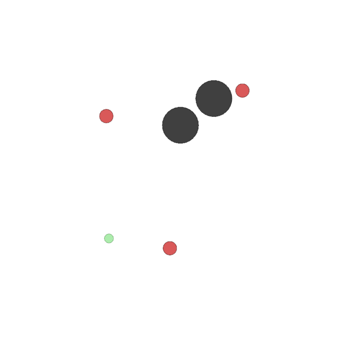

### Simple Tag


This environment is part of the [MPE environments](../mpe). Please read that page first for general information.


`pettingzoo.mpe import simple_tag_v0`


`agents= [adversary_0, adversary_1, adversary_2, agent_0]`





*AEC diagram*


This is a predator-prey environment. Good agents (green) are faster and receive a negative reward for being hit by adversaries (red) (-10 for each collision). Adversaries are slower and are rewarded for hitting good agents (+10 for each collision). Obstacles (large black circles) block the way. By default, there is 1 good agent, 3 adversaries and 2 obstacles.


So that good agents don't run to infinity, they are also penalized for exiting the area by the following function:


```

def bound(x):

      if x < 0.9:

          return 0

      if x < 1.0:

          return (x - 0.9) * 10

      return min(np.exp(2 * x - 2), 10)

```


Agent and adversary observations: `[self_vel, self_pos, landmark_rel_positions, other_agent_rel_positions, other_agent_velocities]`


Agent and adversary action space: `[no_action, move_left, move_right, move_down, move_up]`


```

simple_tag.env(seed=None, num_good=1, num_adversaries=3, num_obstacles=2 , max_frames=100)

```


```

seed: seed for random values. Set to None to use machine random source. Set to fixed value for deterministic behavior


num_good: number of good agents


num_adversaries: number of adversaries


num_obstacles: number of obstacles


max_frames: number of frames (a step for each agent) until game terminates

```
