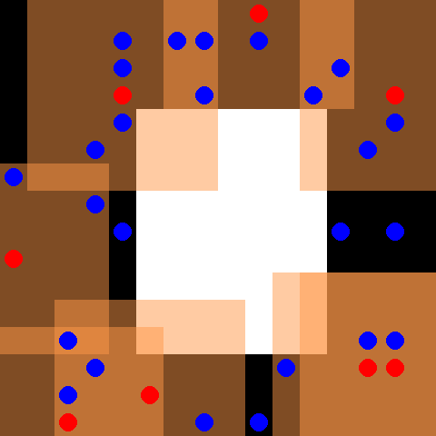

<div class="floatright" markdown="1">



This environment is part of the [SISL environments](../sisl). Please read that page first for general information.



</div>

## Pursuit


By default 30 blue evader agents and 8 red pursuer agents are placed in a 16 x 16 grid with an obstacle, shown in white, in the center. The evaders move randomly, and the pursuers are controlled. Every time the pursuers fully surround an evader each of the surrounding agents receives a reward of 5 and the evader is removed from the environment. Pursuers also receive a reward of 0.01 every time they touch an evader. The pursuers have a discrete action space of up, down, left, right and stay. Each pursuer observes a 7 x 7 grid centered around itself, depicted by the orange boxes surrounding the red pursuer agents. The environment runs for 500 frames by default.  Note that this environment has already had the reward pruning optimization described in the *Agent Environment Cycle Games* paper applied.

Observation shape takes the full form of `(obs_range, obs_range, 3)` where the first channel is 1s where there is a wall, the second channel indicates the number of allies in each coordinate and the third channel indicates the number of opponents in each coordinate.

Manual Control:

Select different pursuers with 'J' and 'K'. The selected pursuer can be moved with the arrow keys.


```
pursuit.env(max_frames=500, xs=16, ys=16, reward_mech='local', n_evaders=30, n_pursuers=8,
obs_range=7, n_catch=2, random_opponents=False, max_opponents=10,
freeze_evaders=False, catchr=0.01, caughtr=-0.01, term_pursuit=5.0,
urgency_reward=0.0, surround=True, constraint_window=1.0,
train_pursuit=True, ally_layer=AgentLayer(xs, ys, n_pursuers),
opponent_layer=AgentLayer(xs, ys, n_evaders))

```

*about arguments*

```
max_frames: after max_frames steps all agents will return done

xs, ys: size of environment world space

reward_mech: Whether a single pursuer is rewarded for an evader being caught, or all pursuers are rewarded

n_evaders: Number of evaders

n_pursuers: Number of pursuers

obs_range: Radius of agent observation view

n_catch: Number pursuers required around an evader to be considered caught

random_opponents: Whether to randomize number of evaders on reset or use argument amount

max_opponents: Maximum number of random evaders on reset, if random_opponents specified

freeze_evaders: Toggles if evaders can move or not

catchr: Reward for 'tagging' a single evader

caughtr: Reward for getting 'tagged' by a pursuer

term_pursuit: Reward added when a pursuer or pursuers catch an evader

urgency_reward: Reward to agent added in each step

surround: Toggles whether evader is removed when surrounded, or when n_catch pursuers are on top of evader

constraint_window: Window in which agents can randomly spawn into the environment world

train_pursuit: Flag indicating if we are simulating pursuers or evaders

ally_layer: Initial pursuers in world

opponent_layer: Initial evader in world
```
